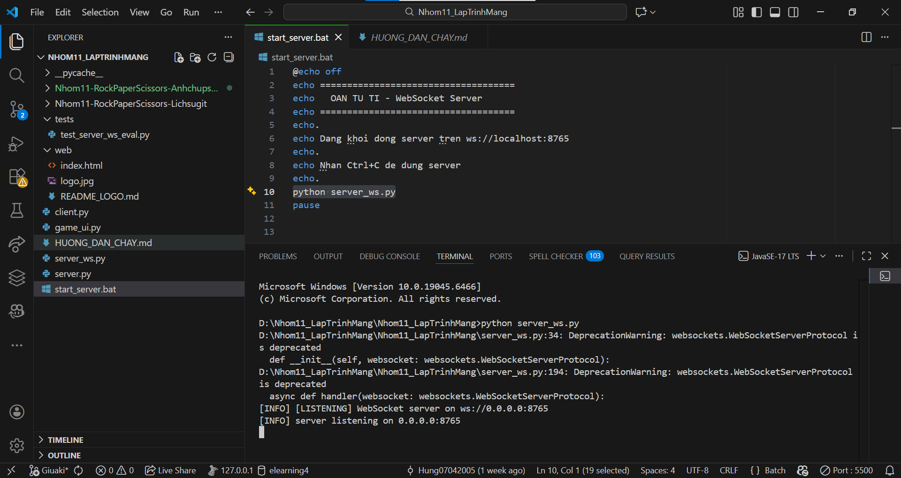
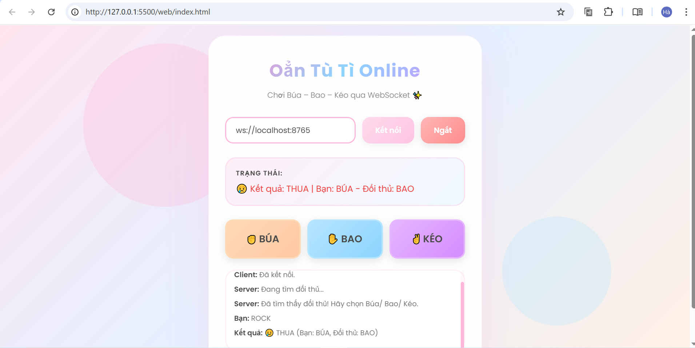
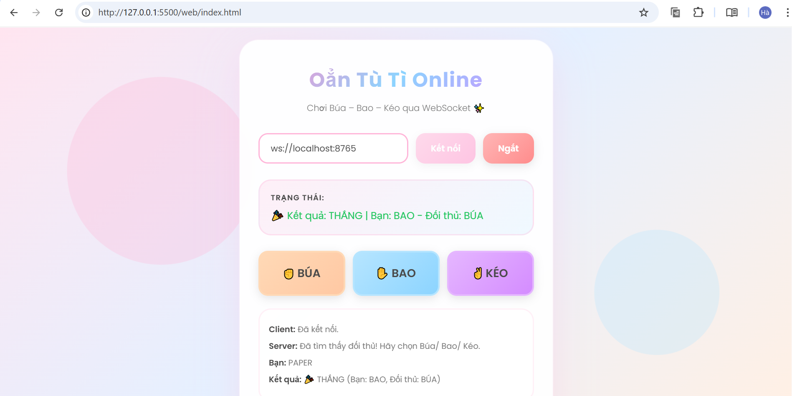

# Hướng Dẫn Chạy Game Oẳn Tù Tì WebSocket

## Ảnh Chụp Sản Phẩm

<div>
   
   <br><em>Giao diện Server</em>
   <br><br>
   
   
   <br><em>Giao diện Client trên hai tab trình duyệt</em>
</div>

## Yêu Cầu
- Python 3.7+
- Thư viện: `websockets`

## Cài Đặt Thư Viện
```bash
pip install websockets
```

## Cách Chạy

### 1. Chạy Server WebSocket

**Cách 1: Dùng script tự động (Windows)**
- Double-click vào file `start_server.bat`
- Hoặc mở PowerShell/CMD và chạy: `.\start_server.bat`

**Cách 2: Chạy thủ công**
```bash
python server_ws.py
```

Bạn sẽ thấy:
```
[LISTENING] WebSocket server on ws://0.0.0.0:8765
```

**⚠️ QUAN TRỌNG:** Giữ cửa sổ terminal này mở trong suốt quá trình chơi!

---

### 2. Mở Client Web

**Cách 1: Mở trực tiếp**
- Double-click vào file `web/index.html`
- File sẽ mở trong trình duyệt mặc định

**Cách 2: Kéo thả**
- Kéo file `web/index.html` vào cửa sổ trình duyệt

**Cách 3: Mở từ trình duyệt**
- Mở trình duyệt (Chrome, Edge, Firefox...)
- Nhấn `Ctrl + O` (hoặc File → Open)
- Chọn file `web/index.html`

---

### 3. Kết Nối và Chơi

1. **Tab 1:**
   - Đảm bảo URL là `ws://localhost:8765`
   - Bấm nút **"Kết nối"** (màu xanh)
   - Trạng thái sẽ hiển thị: "Đã kết nối, đang ghép cặp..."

2. **Tab 2:**
   - Mở tab mới (`Ctrl + T`)
   - Mở lại file `web/index.html` hoặc refresh tab cũ
   - Bấm **"Kết nối"**
   - Cả hai tab sẽ nhận: **"Đã tìm thấy đối thủ! Hãy chọn Búa/ Bao/ Kéo."**

3. **Chơi:**
   - Mỗi người chọn một trong ba nút: ✊ BÚA, ✋ BAO, hoặc ✌ KÉO
   - Kết quả sẽ hiển thị sau khi cả hai đã chọn

---

## Kiểm Tra Lỗi

### Server không chạy được?
- Kiểm tra Python đã cài: `python --version`
- Kiểm tra thư viện: `pip list | findstr websockets`
- Nếu thiếu: `pip install websockets`

### Client không kết nối được?
- Kiểm tra server đã chạy chưa (xem terminal)
- Kiểm tra URL đúng: `ws://localhost:8765`
- Mở Console trình duyệt (F12) để xem lỗi

### Hai tab không ghép cặp được?
- Đảm bảo cả hai tab đều kết nối thành công
- Kiểm tra log trong terminal server
- Kiểm tra Console trình duyệt (F12 → Console)


## Lưu Ý

- Server phải chạy trước khi client kết nối
- Cần ít nhất 2 client để chơi (2 tab hoặc 1 tab + 1 Tkinter)
- Port mặc định: **8765**
- Host mặc định: **localhost** (chỉ chơi trên cùng máy)

---

## Hỗ Trợ

Nếu gặp lỗi, kiểm tra:
1. Log trong terminal server
2. Console trình duyệt (F12)
3. Đảm bảo đã cài đủ thư viện

